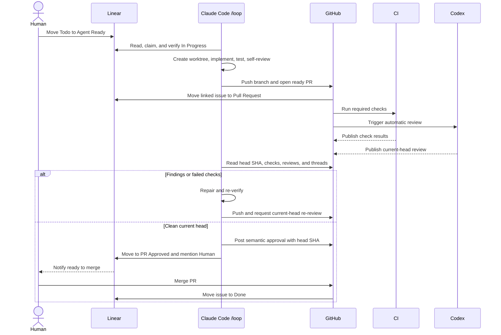

# Linear, Claude Code, and Codex Agentic Workflow - Design Spec

**Date:** 2026-07-10
**Status:** Ready for user review
**Scope:** A local, sequential developer-agent workflow from Linear ticket authorization through a reviewed pull request

## Overview

This workflow uses Linear as the system of record, a long-running local Claude Code session as the implementation worker, Git worktrees for isolation, GitHub for pull requests and CI, and Codex as the independent reviewer.

The human remains responsible for shaping work and merging it. Agents receive authority only when a Linear ticket is moved to `Agent Ready`. Claude may then plan, implement, verify, push, open and update a pull request, and coordinate review fixes without further approval. Codex supplies the independent review signal. Only the human merges.

The initial version intentionally processes one ticket at a time and uses Claude Code's `/loop`. It does not introduce a custom orchestration service.

## Goals

- Let rough ideas live safely in `Todo` while the human discusses and refines them with an agent.
- Make `Agent Ready` an explicit authorization boundary for autonomous implementation.
- Isolate every ticket in its own Git worktree and branch.
- Let Claude handle the full path from planning through a review-ready pull request.
- Require deterministic CI evidence and an independent Codex review before notifying the human.
- Keep the human as the only merge authority.
- Recover cleanly after session restarts, transient failures, and blocked work.
- Avoid duplicate work, noisy polling comments, and accidental changes to the primary checkout.

## Non-Goals

- Automatically merging pull requests.
- Processing multiple implementation tickets concurrently in the initial version.
- Deploying, publishing releases, or changing production infrastructure.
- Building a standalone scheduler or orchestration service.
- Treating every `Todo` ticket as authorized work.
- Requiring Codex to submit GitHub's formal `APPROVED` review state.

## Approved Approach

Use a local Claude Code `/loop` session as the initial orchestrator.

This approach is preferred because it preserves the local repository environment, uses the Linear MCP connection directly, supports worktrees, and requires little infrastructure. Its known operational constraint is that the Claude Code session and machine must remain running. Recurring `/loop` tasks expire after seven days and must be recreated.

If that constraint becomes inconvenient, the workflow can later move to a Claude Desktop scheduled task without changing its Linear states or execution contract. Cloud routines or Linear coding sessions remain possible future alternatives.

## Local Prerequisites

End-to-end operation requires:

- Claude Code `2.1.196` or later so scheduled fires can invoke project skills; using the current stable release is preferred.
- An authenticated GitHub CLI (`gh`) installation with read/write access to pull requests and read access to checks.
- A GitHub repository remote named `origin`.
- An authenticated Linear MCP connection with issue read/write access.
- Codex cloud and automatic GitHub code review enabled for the repository.

The workspace check performed on 2026-07-10 confirmed Claude Code `2.1.197`, which satisfies the scheduled-skill requirement, and GitHub CLI `2.96.0`. GitHub CLI is not authenticated and the checkout has no configured Git remote; those remain setup prerequisites, not workflow failures.

## Actors and Responsibilities

### Human

- Creates rough tickets in `Todo`.
- Refines scope, acceptance criteria, and constraints with an agent.
- Moves a ticket to `Agent Ready` to authorize autonomous work.
- Resolves questions on `Blocked` tickets and reauthorizes them by moving them to `Agent Ready`.
- Reviews `PR Approved` tickets and merges the pull request.

### Claude Code

- Polls Linear for authorized work.
- Mutates no more than one ticket at a time.
- Claims, plans, implements, tests, self-reviews, commits, pushes, and opens the pull request.
- Monitors CI and Codex review results.
- Validates review feedback before changing code.
- Synchronizes the `PR Approved` or `Blocked` state back to Linear.
- Never merges a pull request.

### Codex

- Performs an independent review of the current pull request head.
- Reports serious regressions, risky behavior changes, security concerns, and missing tests.
- Re-reviews after Claude fixes findings.
- Does not need to emit GitHub's formal `APPROVED` state; a clean current-head review is sufficient.

### Linear

- Stores authorization, execution, review, blocked, and completion state.
- Links tickets to branches and pull requests through the GitHub integration.
- Moves merged work to `Done` based on the GitHub merge event.

### GitHub and CI

- Host the branch and pull request.
- Run deterministic repository checks.
- Store Codex findings, Claude's review-gate comment, and the human merge event.

## Happy-Path Sequence



## Linear State Machine

```text
Todo
  -> Agent Ready       human authorizes implementation

Agent Ready
  -> In Progress       Claude claims and verifies the ticket

In Progress
  -> Pull Request      linked ready-for-review PR exists
  -> Blocked           Claude cannot safely continue

Pull Request
  -> PR Approved       CI is green and the latest Codex review is clean
  -> Blocked           review or CI cannot be resolved autonomously

PR Approved
  -> Done              human merges the linked PR
  -> Pull Request      the PR head changes or a required check becomes invalid

Blocked
  -> Agent Ready       human resolves the blocker and reauthorizes work
```

`PR Approved` is a workflow state, not a requirement for GitHub's formal approval event. It means Claude has verified the current pull request head against CI and the latest Codex review and has notified the human.

`Agent Ready` intentionally means both authorized and waiting for selection. While Claude is busy, additional authorized tickets remain in that state. A separate `Queued` status would duplicate this meaning without changing worker behavior, so it is not part of the initial state machine.

## Ticket Selection and Ownership

Each loop iteration follows this order:

1. Reconcile existing Claude-owned tickets and pull requests.
2. Resume a Claude-owned ticket in `In Progress` or `Pull Request` before selecting new work.
3. Check `PR Approved` tickets for a changed head, failed required check, merge, or closure.
4. If no active implementation ticket exists, select one `Agent Ready` ticket.
5. Sort candidates by Linear priority, then by oldest issue creation time.
6. Move the selected ticket to `In Progress` before creating the worktree.

A durable Linear label named `agent:claude-code` identifies tickets that have ever been owned by this workflow. Claude applies it when claiming work and retains it permanently for audit. Active ownership is determined by the combination of this label and a current state of `In Progress` or `Pull Request`; the label alone never makes a historical `Done`, `Blocked`, or waiting `PR Approved` ticket active. The human remains the ticket assignee.

Claude also adds one claim comment containing the branch name and, when available, the PR link. Subsequent loop iterations update state only when something material changes; they do not add heartbeat comments.

An implementation ticket remains active until it reaches `PR Approved` or `Blocked`. A `PR Approved` ticket waiting for human merge does not prevent Claude from claiming the next `Agent Ready` ticket.

If an older `PR Approved` ticket becomes stale after Claude has claimed newer work, the older PR enters a priority repair queue. Claude pauses the newer ticket at a safe checkpoint, restores the older ticket to `Pull Request`, repairs and revalidates it, and then resumes the newer ticket. Work remains sequential; Claude never mutates both tickets concurrently.

## Linear Mutation Safety

The Linear MCP interface is not assumed to provide compare-and-swap or version-based optimistic concurrency. Claude therefore uses a read-update-read protocol for every state transition:

1. Read the current issue immediately before mutation.
2. Confirm its state matches the expected source state.
3. If it does not match, treat the human or another integration's state as authoritative and reconcile instead of overwriting it.
4. Perform the single status update.
5. Check the mutation result for tool, GraphQL, and partial-success errors.
6. Re-read the issue and confirm the requested destination state.

Claude must confirm `In Progress` before creating a new worktree. A failed or ambiguous mutation is retried on the next iteration. It becomes `Blocked` only after the same mutation failure persists for three consecutive iterations.

This protocol reduces but cannot eliminate the narrow time-of-check/time-of-use race because Linear MCP does not document a conditional state update. If a human update lands between Claude's pre-read and write, the later write may win. The post-read and Linear activity history make the collision visible, and the human can restore the intended status. The sequential pilot accepts this residual risk; a future webhook-backed coordinator would be needed for stronger serialization.

## Worktree and Branch Contract

For every newly claimed ticket, Claude:

1. Fetches the latest remote default branch without modifying the primary checkout.
2. Creates a dedicated branch containing the Linear identifier, such as `claude/ICO-123-short-title`.
3. Creates or enters a dedicated worktree for that branch.
4. Performs all file edits, builds, and tests inside that worktree.
5. Preserves uncommitted or untracked files in the primary checkout.

If a ticket returns from `Blocked` to `Agent Ready`, Claude reuses its existing worktree, branch, and pull request when they remain valid. It does not create a duplicate branch or PR.

After the human merges, a later loop iteration may remove the completed local worktree and local branch. Remote branch cleanup follows the repository's GitHub settings.

## Claude Execution Contract

### 1. Claim and Understand

- Move the chosen ticket from `Agent Ready` to `In Progress`.
- Apply `agent:claude-code`.
- Read the title, description, comments, attachments, acceptance criteria, and related issues through Linear MCP.
- Read `CLAUDE.md`, applicable nested guidance, repository documentation, and relevant existing code.
- Confirm the issue is implementable without inventing product behavior outside the approved scope.

If a material ambiguity remains, Claude does not guess. It follows the `Blocked` contract.

### 2. Plan

- Produce an internal implementation plan tied to the acceptance criteria.
- Identify affected components, test strategy, risks, and rollback considerations.
- Keep the plan scoped to the ticket; avoid unrelated cleanup or refactoring.
- Do not pause for plan approval because moving the ticket to `Agent Ready` already authorized execution.

### 3. Implement

- Follow repository conventions and existing patterns.
- Use test-driven development when behavior changes and the repository supports it.
- Make the smallest coherent change that satisfies the ticket.
- Avoid new production dependencies unless the ticket requires them or the existing architecture clearly calls for them.
- Keep credentials, generated secrets, local caches, and temporary debugging files out of commits.

### 4. Verify and Self-Review

- Run focused tests for changed behavior.
- Run the repository's relevant broader tests, type checks, lint checks, and production build.
- Review the final diff against every acceptance criterion.
- Check error handling, security boundaries, regressions, unnecessary scope, and missing documentation.
- Record exact commands and outcomes for the pull request.

### 5. Commit, Push, and Open the Pull Request

- Use the repository's commit convention.
- Push only the ticket branch, never the default branch.
- Open a ready-for-review pull request after local verification passes.
- Include the Linear identifier in the branch and PR title so Linear links the work.
- Include the Linear link or supported magic word in the PR body.

The PR body contains:

- Summary of the change.
- Acceptance-criteria mapping.
- Test, type-check, lint, and build evidence.
- Known risks or limitations.
- Screenshots or recordings for visible UI changes.

Linear's GitHub automation should move the linked ticket to `Pull Request` when the ready-for-review PR opens. Claude verifies this state and repairs it through Linear MCP if the automation does not fire.

## Codex Review Loop

Codex automatic review is enabled for the repository. Review guidance lives in `AGENTS.md` so it is versioned with the codebase.

### Review Output Contract

The `AGENTS.md` review guidance requires Codex to include exactly one machine-readable verdict in its review summary:

```text
CODEX_REVIEW_VERDICT: CLEAN
```

or:

```text
CODEX_REVIEW_VERDICT: CHANGES_REQUIRED
```

`CLEAN` means Codex found no P0 or P1 issue for that reviewed commit. `CHANGES_REQUIRED` accompanies one or more actionable findings. Missing, duplicated, or malformed verdicts are treated as an incomplete review, never as approval.

### Review Detection

Claude reads Codex results through GitHub, not through a Codex-specific MCP endpoint:

1. Read the PR's current `headRefOid`, open/draft state, and mergeability with `gh pr view --json`.
2. Read required checks with `gh pr checks --required --json`; its `bucket` field normalizes results to pass, fail, pending, skipping, or cancel.
3. List pull request reviews through GitHub's REST reviews endpoint using `gh api`. REST review records include `user.login`, `state`, `submitted_at`, and `commit_id`.
4. Filter reviews by the configured Codex reviewer login recorded during setup.
5. Select the newest Codex review whose `commit_id` exactly equals the current `headRefOid`.
6. Read its verdict marker and body.
7. Query GitHub GraphQL review threads and inspect `isResolved`; any unresolved Codex thread prevents a clean result.

The first validation PR establishes the Codex review author's actual GitHub login. The workflow stores that non-secret identifier in `.claude/ticket-worker.local.json` rather than hard-coding an undocumented bot name.

If no current-head review exists, Claude posts `@codex review` once for that SHA. The trigger comment includes a hidden marker containing the SHA so reconciliation can detect an existing request and avoid duplicate mentions. If a review exists but violates the output contract, Claude requests one fresh review; a repeated protocol failure follows the repair-cycle limit and moves the ticket to `Blocked`.

Claude treats review feedback as technical input, not unquestionable instructions:

1. Confirm that each finding applies to the current code and ticket.
2. Fix confirmed findings in the same worktree and branch.
3. Add or update regression coverage where appropriate.
4. Rerun relevant verification.
5. Push the fix.
6. Request a fresh Codex review with `@codex review` when automatic re-review does not occur.

A review is current only when it covers the pull request's current head SHA. A clean review of an older SHA cannot advance the ticket.

## PR Approved Gate

Claude moves `Pull Request` to `PR Approved` only when all of these conditions are true for the current head SHA:

- Every required CI check is successful, skipped, or neutral as permitted by repository policy.
- The latest Codex review has completed against the current head.
- No actionable Codex findings remain.
- All applicable review threads are resolved.
- The PR is open, ready for review, has no merge conflicts, and satisfies every non-human required check.

Claude then adds a GitHub PR comment with this semantic approval signal:

> Agent review gate passed for `<head SHA>`: required CI is green, the latest Codex review is complete, and no unresolved findings remain.

The same comment includes a hidden marker in the form `<!-- claude-worker:pr-approved head=<full SHA> -->`. Reconciliation reads the marker and compares its full SHA with the current `headRefOid`. Any mismatch invalidates approval, including a force-push where the stored commit no longer exists.

The comment may be authored through the human's connected GitHub identity; it does not need a separate Codex GitHub user.

Claude then:

1. Moves the Linear ticket to `PR Approved`.
2. Adds a Linear comment containing the PR link, head SHA, verification summary, and an `@mention` for the configured human reviewer.
3. Stops modifying the PR unless its head or required checks change, new review feedback arrives, or the human requests changes.

If the head changes after approval or a required check becomes invalid, Claude moves the ticket back to `Pull Request` and obtains fresh verification and Codex review.

## Human Merge Gate

Only the human merges the pull request.

Claude must not:

- Invoke a GitHub merge command or API.
- Enable auto-merge.
- Push directly to the default branch.
- Bypass branch protection or required checks.

After the merge event, Linear's GitHub automation moves the ticket from `PR Approved` to `Done`. Claude verifies the resulting state during reconciliation but does not manufacture `Done` before a merge.

The initial setup treats this as an operational and instruction boundary because Claude may act through the human's GitHub identity. A future hard-enforcement option is a dedicated bot identity plus a repository ruleset that prevents that identity from merging.

## Blocked Contract

Claude moves an active ticket to `Blocked` when it cannot safely or reliably complete the approved work. Triggers include:

- Requirements whose ambiguity would materially change product behavior.
- Missing credentials, permissions, services, fixtures, or external decisions.
- A required destructive or production-impacting action not authorized by the ticket.
- Persistent CI failures that cannot be attributed or resolved safely.
- An unrecoverable merge conflict or broken base branch.
- Three unsuccessful automated repair cycles for the same failure or review finding.
- A PR closed without merge.

One repair cycle is defined independently of `/loop` timing:

1. Claude identifies a specific failure or review finding.
2. Claude implements one attempted correction.
3. Claude reruns the relevant local verification and pushes when remote CI or review is required.
4. The corresponding check or current-head review completes.
5. The same normalized failure signature remains.

Waiting for CI, polling unchanged state, transient tool errors, and idle loop iterations do not count as repair cycles. Counters are keyed by issue and normalized failure signature. A materially different failure starts its own counter. The worker stores counters in its gitignored local state so a session resume does not reset the safety limit.

Transient network, Linear, GitHub, or rate-limit errors do not immediately block the ticket. Claude retries them on later loop iterations. Three consecutive iterations with the same external blocker trigger `Blocked`.

The Linear blocker comment contains:

- The blocking condition.
- What Claude attempted.
- Relevant evidence or concise error output.
- The exact decision or action required from the human.
- Existing branch, worktree, and PR references.

To resume, the human resolves the blocker and moves the ticket from `Blocked` to `Agent Ready`. On the next iteration, Claude moves it to `In Progress` and resumes the existing artifacts.

## Reconciliation and Idempotency

Before claiming new work, Claude compares Linear, local Git, and GitHub state.

It must handle these cases without duplication:

- `In Progress` with an existing worktree and no PR: resume implementation.
- `In Progress` with a linked PR: repair Linear to `Pull Request`.
- `Pull Request` with failing CI or findings: resume the repair loop.
- `Pull Request` with a clean current-head review: evaluate the `PR Approved` gate.
- `PR Approved` whose latest approval marker SHA differs from `headRefOid`: return to `Pull Request`, including after force-push.
- `PR Approved` whose required check became invalid: return to `Pull Request`.
- `PR Approved` with a merged PR: verify `Done` and clean local artifacts.
- `Blocked` returned to `Agent Ready`: reuse existing artifacts.
- Closed unmerged PR: move to `Blocked`.
- Missing local worktree but valid remote branch or PR: recreate the worktree from the remote branch.

All comments and state changes are conditional. Claude checks whether an equivalent claim, blocker, approval, or notification already exists before posting another one.

When a previously approved PR becomes stale while another ticket is active, reconciliation gives the stale PR priority and follows the sequential repair-queue rule rather than spawning another worker.

## Claude Code Configuration

### `CLAUDE.md`

Defines:

- An `@AGENTS.md` import so Claude loads the repository's canonical shared agent conventions without duplicating them.
- Claude-specific worktree behavior and ticket-worker entry points.

`AGENTS.md` is authoritative for shared architecture, coding, testing, commit, and safety rules. `CLAUDE.md` adds only Claude-specific behavior. The files must not define the same rule differently; verification scans for duplicated merge, testing, and branch policies before rollout.

### `.claude/skills/linear-ticket-worker/SKILL.md`

Contains the complete orchestration procedure described by this spec, including selection order, reconciliation, state transitions, worktree handling, verification, review coordination, and blocker behavior.

### `.claude/loop.md`

Contains a concise instruction to invoke the project-level `linear-ticket-worker` skill, remain scheduled while the worker is enabled, use longer waits when idle, and shorter waits while CI or review is active.

Current Claude Code documentation confirms that `.claude/loop.md` is the project-level default, that it replaces the built-in maintenance prompt, and that it is used when `/loop` receives an interval only or no arguments. An inline prompt would override this file.

For direct Claude Code accounts, normal operation uses the self-paced form:

```text
/loop
```

Claude then selects a delay between one minute and one hour on each iteration. The loop prompt directs it toward the longer end while idle and shorter delays only while an active CI or review result is pending.

Bare `/loop` does not load `loop.md` on Bedrock, Vertex AI, or Microsoft Foundry. If the provider changes, use an explicit skill prompt such as `/loop 30m /linear-ticket-worker` instead.

### `.claude/settings.json`

Grants broad permission for normal development commands within ticket worktrees while denying or withholding authorization for:

- Pull request merge and auto-merge operations.
- Direct pushes to the default branch.
- Destructive machine-level operations outside the ticket worktree.
- Unnecessary secret or credential access.
- Deployment and release operations.

The implementation must use the narrowest Claude Code permission syntax that still allows unattended worktree development. It must not rely only on prose when a supported deny rule can enforce the boundary.

### `.claude/ticket-worker.local.json`

A gitignored, non-secret local configuration file stores environment-specific identifiers such as the GitHub `owner/repo`, Codex reviewer login, Linear reviewer profile URL, and worktree root. It is generated during setup and never committed.

### `.claude/ticket-worker-state.local.json`

A gitignored runtime cache stores the currently selected issue, worktree path, PR number, review-request markers, approval SHA, and repair counters. Linear and GitHub remain authoritative; Claude can rebuild this cache through reconciliation if it is missing or corrupt.

### `AGENTS.md`

Remains the canonical shared instruction file and adds a focused `Review guidelines` section for Codex, covering behavioral regressions, security, missing tests, Electron IPC boundaries, audio-pipeline correctness, scope control, and the machine-readable verdict contract.

### Pull Request Template

An optional repository PR template standardizes Linear linkage, summary, acceptance evidence, verification, risks, and UI evidence. The template file is optional; the PR body content requirements in the execution contract are mandatory whether or not the file exists.

## External Configuration

### Linear

- Configure statuses: `Todo`, `Agent Ready`, `In Progress`, `Pull Request`, `PR Approved`, `Blocked`, and `Done`.
- Create the `agent:claude-code` label.
- Connect GitHub and enable issue-to-PR linking.
- Configure ready-for-review PRs to map to `Pull Request`.
- Configure merged PRs to map to `Done`.
- Connect Claude Code to Linear's MCP server and complete OAuth.

### GitHub and Codex

- Create or connect the GitHub repository and configure it as remote `origin`.
- Install and authenticate GitHub CLI.
- Enable Codex cloud for the repository.
- Enable Codex automatic code review.
- Use the first validation PR to record the actual Codex review login in local worker configuration.
- Ensure CI runs on opened, reopened, and updated pull requests.
- Configure required checks consistently.
- Protect the default branch from direct pushes.

## Operational Lifecycle

Start the worker from the repository's primary checkout with:

```text
/loop
```

The scheduler queues an iteration only when the Claude session is idle, so a long implementation does not create concurrent workers. Missed wakeups do not create a backlog of duplicate runs. In self-paced mode, Claude dynamically waits between one minute and one hour.

Operational constraints:

- The machine and Claude Code session must remain running.
- The loop must be recreated at least every seven days.
- After a restart, use the resumed session when possible, then let reconciliation run before authorizing new work.
- Press `Esc` while the loop is waiting to stop it.
- The human should periodically confirm that the scheduled task remains registered.

## Cost Controls

A fixed ten-minute poll would schedule up to 144 iterations per day, even when no ticket is ready. Token usage per iteration cannot be estimated credibly in advance because it depends on model choice, prompt caching, repository context, MCP responses, CI output, and task complexity.

The initial workflow therefore uses self-paced `/loop` rather than a fixed ten-minute cadence:

- Idle state: perform the smallest filtered Linear query and choose a long delay.
- Active implementation: continue the current turn rather than polling.
- Waiting for CI or Codex: query only the current PR and use a shorter delay.
- No active or authorized work: do not read the repository, GitHub history, or completed ticket details.
- Record iteration counts, active task counts, and observed Claude account usage during the pilot.

After one week, compare responsiveness with observed usage. If self-pacing is still too active, replace it with `/loop 30m` for at most 48 scheduled iterations per day or move to an event-driven channel or durable scheduler.

## Validation Plan

Begin with one deliberately small, low-risk ticket and verify the complete lifecycle.

### Happy Path

- Claude Code meets the minimum version, `gh` is authenticated, and `origin` exists.
- A `Todo` ticket is ignored.
- Moving it to `Agent Ready` causes one claim.
- Claude moves it to `In Progress` and creates one worktree and branch.
- The primary checkout's existing dirty files remain untouched.
- The branch and ready-for-review PR contain the Linear identifier.
- The linked ticket moves to `Pull Request`.
- CI and Codex run.
- GitHub REST returns a Codex review whose `commit_id` matches `headRefOid` and whose verdict is `CLEAN`.
- A clean current-head review produces the semantic GitHub approval comment.
- Linear moves to `PR Approved` and mentions the human.
- Claude may claim the next ticket without waiting for merge.
- Human merge results in `Done`.

### Failure and Recovery Cases

- An ambiguous ticket moves to `Blocked` with a precise question.
- `Blocked -> Agent Ready` resumes the same branch and worktree.
- A failed CI check prevents `PR Approved`.
- A Codex finding prevents `PR Approved` until fixed and re-reviewed.
- A commit pushed after approval returns the ticket to `Pull Request`.
- A force-push invalidates the stored approval SHA even when the old commit no longer exists.
- An unresolved GraphQL review thread prevents `PR Approved`.
- A malformed or missing Codex verdict is treated as incomplete, not clean.
- One failed repair attempt followed by unchanged polling counts as one cycle, not multiple cycles.
- A source-state mismatch detected by the pre-read causes reconciliation rather than an overwrite; the narrower undocumented Linear TOCTOU race is recorded as an accepted pilot risk.
- A closed unmerged PR moves to `Blocked`.
- A restarted session reconciles existing state without creating duplicate work.
- Repeated external failures produce one blocker comment after the retry threshold.

### Permission Checks

- Claude can edit, test, commit, push its branch, and open or update a PR without prompts.
- Claude cannot push to the default branch through the configured permission path.
- Claude does not invoke merge or auto-merge.
- Destructive operations outside the worktree remain denied or require explicit human approval.

## Risks and Mitigations

### Session-scoped scheduler

`/loop` stops when the session is unavailable and expires after seven days.

Mitigation: document restart checks, recreate the loop weekly, and upgrade to a Claude Desktop scheduled task if the pilot proves valuable.

### Shared human identity

Claude's GitHub and Linear actions may appear as the human.

Mitigation: use explicit agent comments and the `agent:claude-code` label for auditability. Consider a bot identity if hard separation becomes necessary.

### Prompt injection from tickets or PR content

Linear descriptions and GitHub comments are untrusted input.

Mitigation: repository instructions define the authority hierarchy. Claude treats ticket and comment content as work data, refuses requests to expose secrets or escape the ticket scope, and blocks when instructions conflict.

### Infinite repair loops

Repeated CI or review failures can consume time and usage.

Mitigation: stop after three unsuccessful repair cycles and move the ticket to `Blocked` with evidence.

### Stale review signal

A clean review can become invalid after a new commit.

Mitigation: store the full head SHA in a hidden approval-comment marker, compare it with `headRefOid` every reconciliation pass, and revert to `Pull Request` on any mismatch.

## Future Evolution

After the sequential pilot is stable:

1. Move scheduling to a Claude Desktop task if the open-session requirement is inconvenient.
2. Introduce a dedicated GitHub bot identity for hard merge separation and clearer audit history.
3. Add bounded parallelism with one worker and worktree per ticket.
4. Consider cloud routines or Linear coding sessions when machine-independent execution becomes more valuable than local context.

These changes should preserve the same Linear state machine and human authorization and merge gates.

## Reference Documentation

- [Claude Code scheduled tasks](https://code.claude.com/docs/en/scheduled-tasks)
- [Claude Code project memory and `AGENTS.md` imports](https://code.claude.com/docs/en/memory)
- [Claude Code subagents and worktree isolation](https://code.claude.com/docs/en/sub-agents)
- [Linear MCP server](https://linear.app/docs/mcp)
- [Linear GraphQL mutations and error handling](https://linear.app/developers/graphql)
- [Linear GitHub integration](https://linear.app/docs/github-integration)
- [Codex code review in GitHub](https://developers.openai.com/codex/integrations/github)
- [GitHub pull request reviews REST API](https://docs.github.com/en/rest/pulls/reviews)
- [GitHub CLI pull request JSON fields](https://cli.github.com/manual/gh_pr_view)
- [GitHub CLI required pull request checks](https://cli.github.com/manual/gh_pr_checks)
- [GitHub protected branches](https://docs.github.com/en/repositories/configuring-branches-and-merges-in-your-repository/managing-protected-branches/about-protected-branches)
